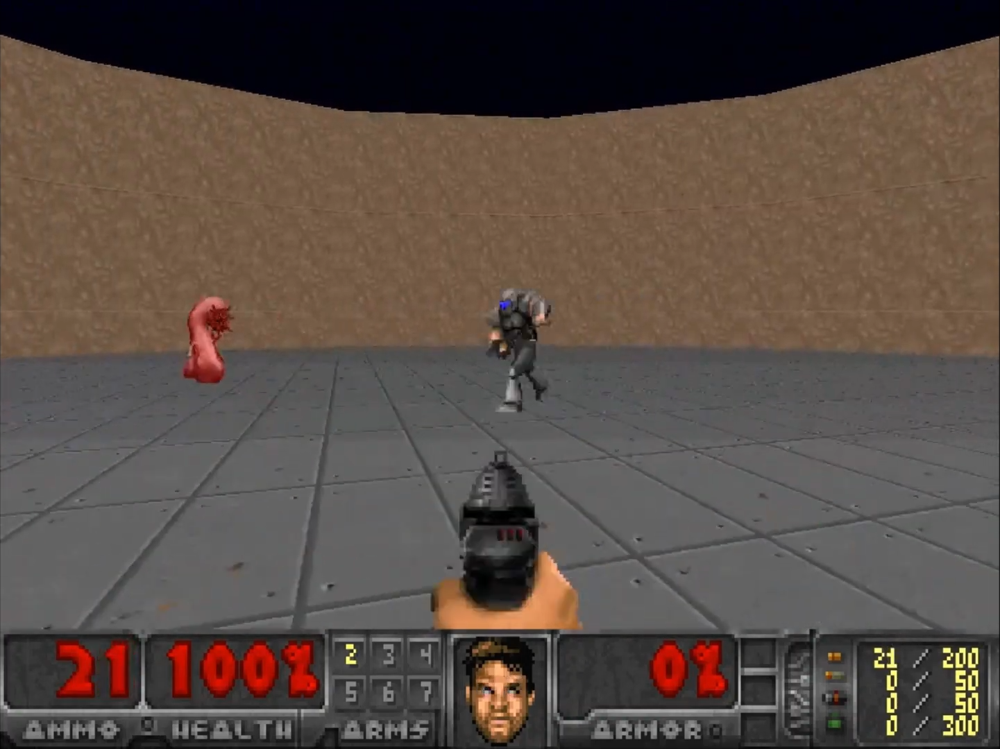
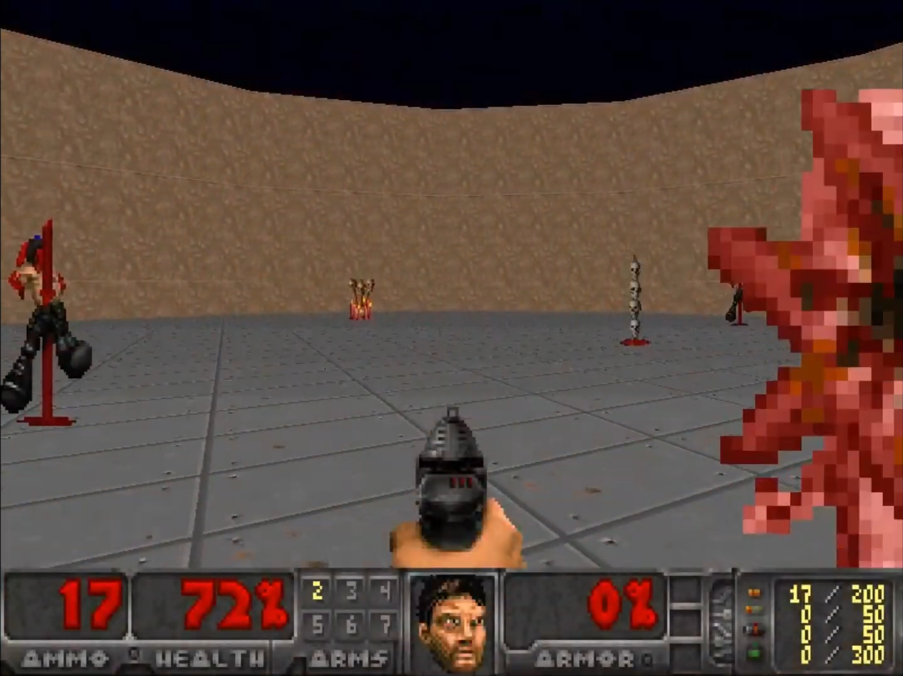
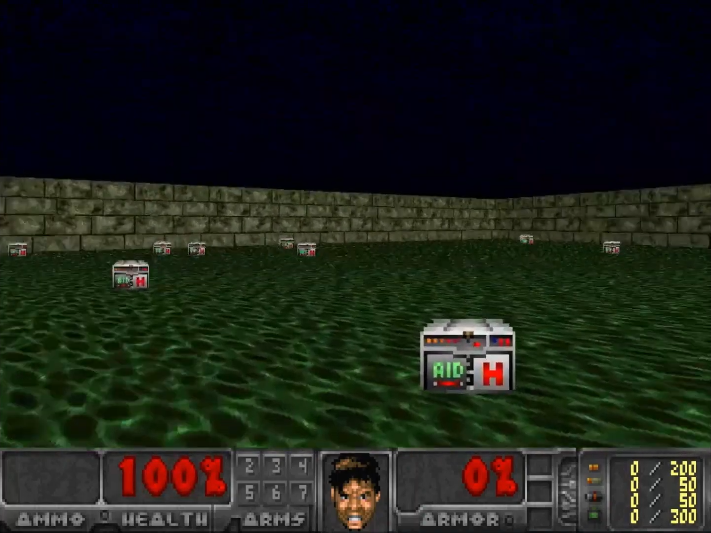
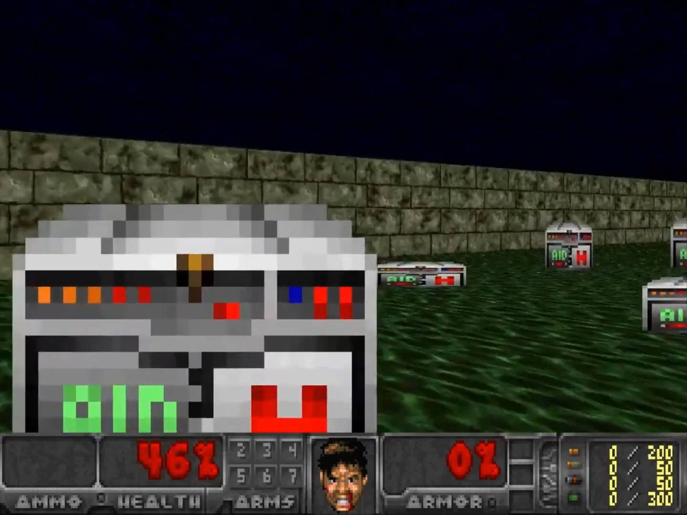
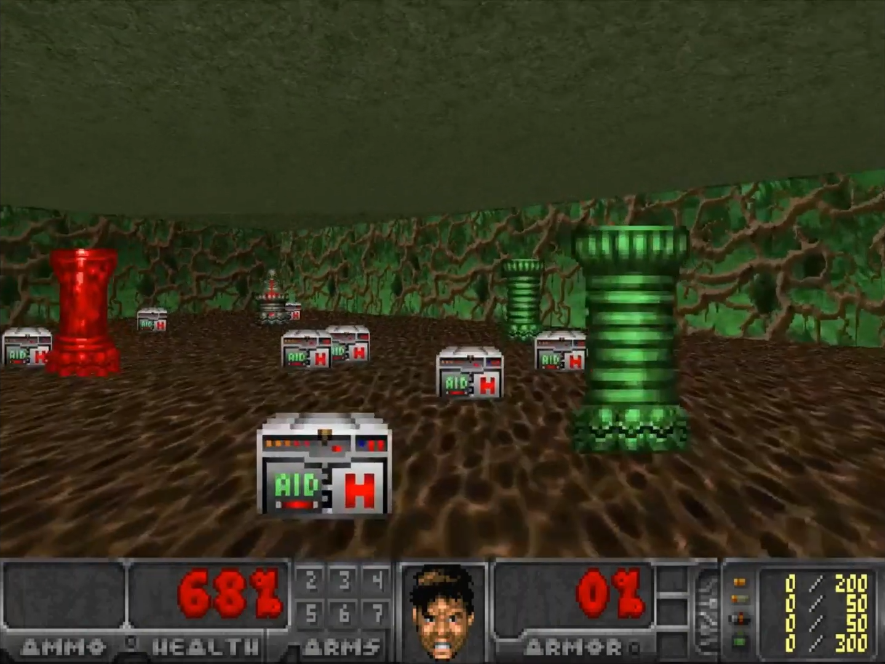
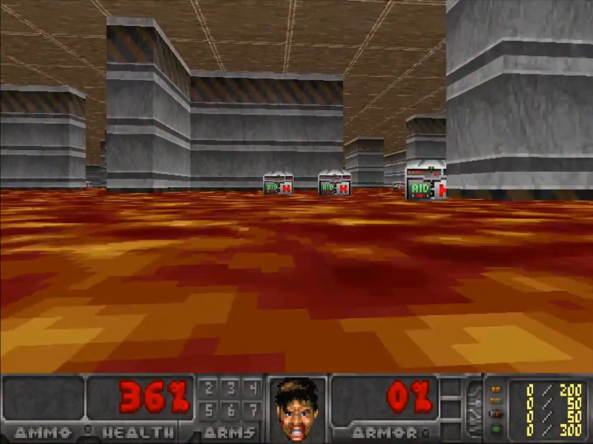
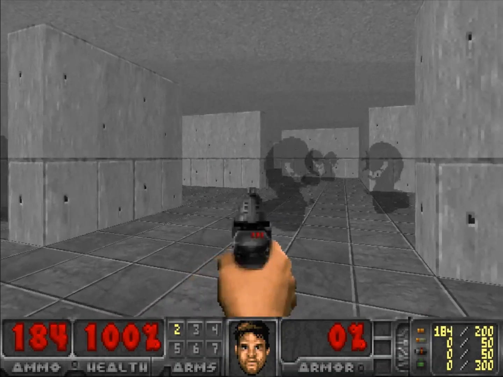
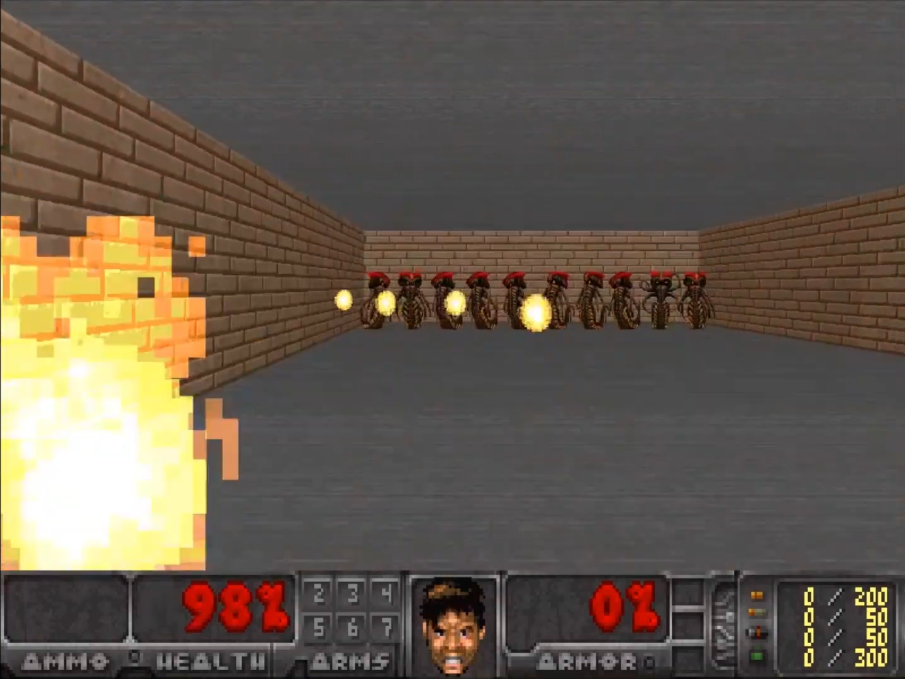
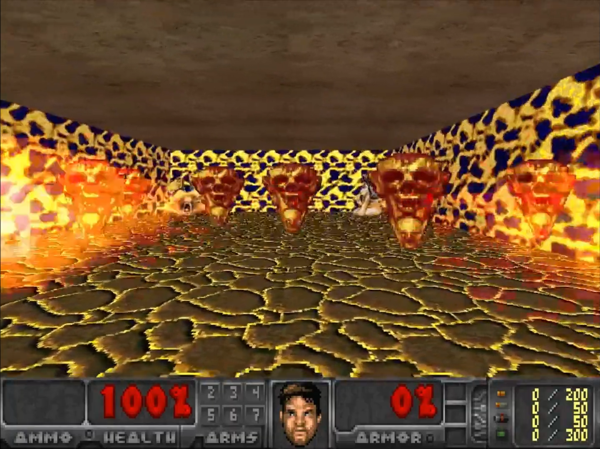
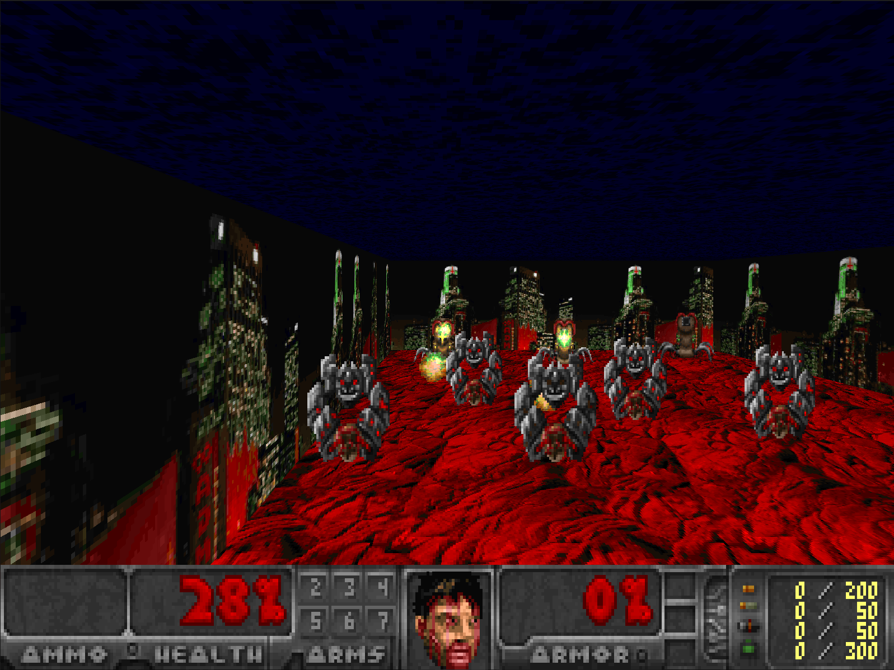

# LevDoom
LevDoom is a benchmark with difficulty levels based on visual modifications, intended for research 
in generalization of deep reinforcement learning agents. The benchmark is based upon 
[ViZDoom](https://github.com/Farama-Foundation/ViZDoom), a platform addressed to pixel based learning in the 
FPS game domain.

For more details please refer to our [CoG2022](https://ieee-cog.org/2022/assets/papers/paper_30.pdf) paper.
To reproduce the paper results, follow the instructions in the [RL](rl/README.md) module.


## Installation
To install LevDoom from PyPi, just run:
```bash
$ pip install LevDoom
```
Alternatively, to install LevDoom from source, clone this repo, cd to it, and then:
1. Clone the repository
```bash
$ git clone https://github.com/TTomilin/LevDoom
```
2. Navigate into the repository
```bash
$ cd LevDoom
```
3. Install the dependencies 
```bash 
$ pip install .
```
## Environments
The benchmark consists of 4 scenarios, each with 5 levels of increasing difficulty.
The full list of environments can be found in the [LevDoom](levdoom/README.md) module.

| Scenario          | Success Metric | Enemies | Weapon  | Items   | Max Steps | Actions | Stochasticity                   | 
|-------------------|----------------|---------|---------|---------|-----------|---------|---------------------------------|
| Defend the Center | Frames Alive   | &check; | &check; | &cross; | 2100      | 6       | Enemy behaviour                 | 
| Health Gathering  | Frames Alive   | &cross; | &cross; | &check; | 2100      | 6       | Health kit spawn locations      |
| Seek and Slay     | Kill Count     | &check; | &check; | &cross; | 1250      | 12      | Enemy and agent spawn locations |
| Dodge Projectiles | Frames Alive   | &check; | &cross; | &cross; | 2100      | 6       | Enemy behaviour                 |


### Environment Modifications
LevDoom imposes generalization difficulty by modifying the base environment of a scenario.
Each modification increases the difficulty level of the generalization task. 
There are 8 types of modifications across all scenarios.

| Modification     | Description                                                              |
|------------------|--------------------------------------------------------------------------|
| Textures         | Varies the appearance of the walls, ceilings and floors                  |
| Obstacles        | Adds impassable obstructions to the map that impede the agent's movement |
| Entity Size      | Changes the size of enemies and obtainable items                         |
| Entity Type      | Changes the type of enemies and obtainable items                         |
| Entity Rendering | Varies the rendering type of enemies and obtainable items                |
| Entity Speed     | Increases the speed of enemies                                           |
| Agent Height     | Vertically shifts the view point of the agent                            |


### Difficulty Levels
The number of combined modifications determines the difficulty level.

| Scenario          | Level 0                                                        | Level 1                                                                 | Level 2                                                                                              | Level 3                                                                                                                  | Level 4                                                          |
|-------------------|----------------------------------------------------------------|-------------------------------------------------------------------------|------------------------------------------------------------------------------------------------------|--------------------------------------------------------------------------------------------------------------------------|------------------------------------------------------------------|
| Defend the Center |  |                 |  |  |  |
| Health Gathering  |   |  |             |                   |   |
| Seek and Slay     |      |               |      |                      |      |
| Dodge Projectiles |  |             |                                    |          |  |


# Quick Start
LevDoom follows the [Gymnasium](https://github.com/Farama-Foundation/Gymnasium) interface. You can create an environment using the `make` function:
```python
import levdoom

env = levdoom.make('DefendTheCenterLevel0-v0')
```
You can also directly create all environments of a level using the `make_level` function:
```python
import levdoom
from levdoom.utils.enums import Scenario

level_envs = levdoom.make_level(Scenario.DODGE_PROJECTILES, level=3)
```


## Examples
Find examples of using LevDoom environments in the [examples](levdoom/examples) folder.

### Single Environment

```python
import levdoom

env = levdoom.make('HealthGatheringLevel3_1-v0')
env.reset()
done = False
steps = 0
total_reward = 0
while not done:
    action = env.action_space.sample()
    state, reward, done, truncated, info = env.step(action)
    env.render()
    steps += 1
    total_reward += reward
print(f"Episode finished in {steps} steps. Reward: {total_reward:.2f}")
env.close()
```

### Single Level
```python
import levdoom
from levdoom.utils.enums import Scenario

max_steps = 100
level_envs = levdoom.make_level(Scenario.SEEK_AND_SLAY, level=1, max_steps=max_steps)
for env in level_envs:
    env.reset()
    total_reward = 0
    for i in range(max_steps):
        action = env.action_space.sample()
        state, reward, done, truncated, info = env.step(action)
        env.render()
        total_reward += reward
        if done or truncated:
            break
    print(f"{env.unwrapped.name} finished in {i + 1} steps. Reward: {total_reward:.2f}")
    env.close()
```

## Citation
If you use our work in your research, please cite it as follows:
```bibtex
@inproceedings{tomilin2022levdoom,
  title     = {LevDoom: A Benchmark for Generalization on Level Difficulty in Reinforcement Learning},
  author    = {Tristan Tomilin and Tianhong Dai and Meng Fang and Mykola Pechenizkiy},
  booktitle = {In Proceedings of the IEEE Conference on Games},
  year      = {2022}
}
```