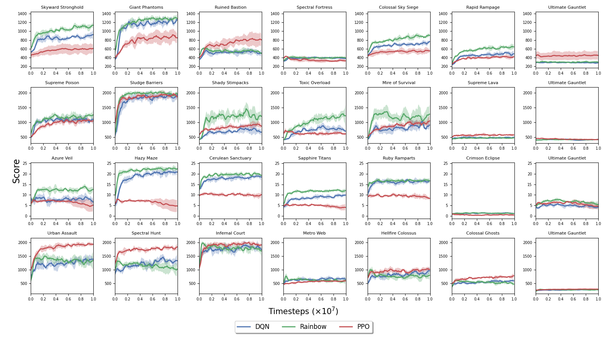
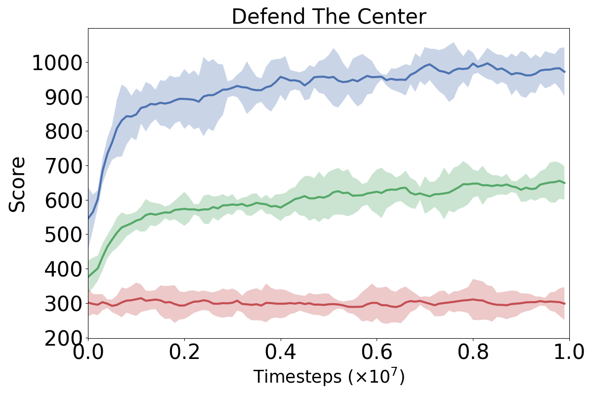
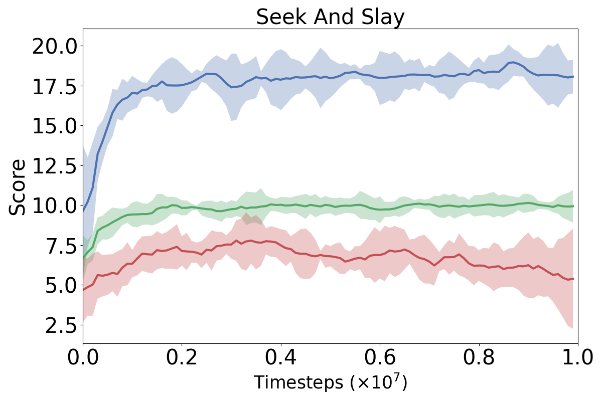

# Reinforcement Learning Module

## Baseline experiments

### Individual Environments
We evaluate the generalizability of three popular RL algorithms on the LevDoom benchmark: DQN, PPO, Rainbow.
The agent is trained on levels 0 and 1 in a multi-task setting and tested on the remaining highger levels. 
The results are aggregated over 5 seeds. Each scenario has its own success metric.



### Level Difficulty
Aggregated results across all evaluation levels for each scenario. The results are averaged over 5 seeds.

|  |  |  |  |
|:--------------------------------------------------------:|:------------------------------------------------------:|:----------------------------------------------------:|:------------------------------------------------------:|


### Reproducing results

- PPO

```bash
$ python run.py --algorithm ppo --scenario $SCENARIO --train_levels 0 1 --test_levels 2 3 4 \
        --seed $SEED --epoch 100
```

- Rainbow

```bash
$ python run.py --algorithm rainbow --scenario $SCENARIO --train_levels 0 1 --test_levels 2 3 4 \
        --seed $SEED --epoch 100 --lr 0.0001 --step-per-collect 10 --batch-size 64
```

- DQN

```bash
$ python run.py --algorithm dqn --scenario $SCENARIO --train_levels 0 1 --test_levels 2 3 4 \
        --seed $SEED --epoch 100 --lr 0.0001 --step-per-collect 10 --batch-size 64
```

where

```
$SEED = {1, 2, 3, 4, 5}  
$SCENARIO = {defend_the_center, health_gathering, seek_and_slay, dodge_projectiles}
```

#### WandB support

Our experiments were managed using [WandB](https://wandb.ai). In order to setup WandB locally
run `wandb login` in the terminal ([WandB Quickstart](https://docs.wandb.ai/quickstart#1.-set-up-wandb)).
We configure WandB using the following arguments:

```
--with_wandb: Enables Weights and Biases integration (default: False)
--wandb_user: WandB username (entity). Must be specified from command line! Also see https://docs.wandb.ai/quickstart#1.-set-up-wandb (default: None)
--wandb_key: WandB API key. Might need to be specified if running from a remote server. (default: None)
--wandb_project: WandB "Project" (default: LevDoom)
--wandb_group: WandB "Group" (to group your experiments). By default this is the name of the env. (default: None)
--wandb_job_type: WandB job type (default: SF)
--wandb_tags: [WANDB_TAGS [WANDB_TAGS ...]] Tags can help with finding experiments in WandB web console (default: [])
```

Once the experiment is started, the link to the monitored session is going to be available in the logs (or by searching
in the Wandb Web console).

## References

We use the implementation of DQN, Rainbow and PPO from [Tianshou](https://github.com/thu-ml/tianshou).